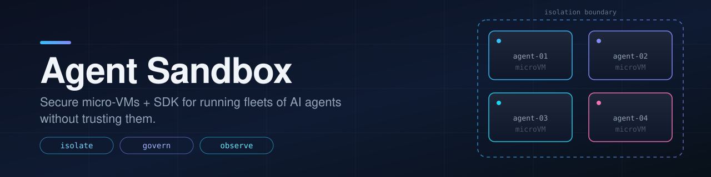

<p align="center">
  
</p>

<p align="center">
  <a href="LICENSE"></a>
  
  
</p>

# Agent Sandbox

**Secure micro-VMs + SDK so enterprises can run many AI agents and models — without trusting any of them.**

AI agents execute unreviewed, model-generated code against real credentials and real networks. The industry consensus (AWS, Google, Microsoft, Anthropic, OpenAI all agree) is that model-layer defenses are probabilistic — hard guarantees must come from the *environment*: isolation, egress control, credential brokering, policy, and audit. This project explores the piece of that stack nobody owns yet.

## The gap we're aiming at

Our [landscape research](RESEARCH.md) across 30+ products found the isolation layer is crowded (Firecracker, gVisor, Kata, E2B, Modal, microsandbox…) but the **governance layer is open**:

- **No runtime-agnostic policy-as-code.** "This agent may reach `api.github.com`, read `/workspace`, and never see raw secrets" — declared once, enforced identically on a laptop and a server fleet. Nobody ships this.
- **No tamper-evident audit.** Not one project records what agents actually did — every exec, file mutation, and network flow, attributable to an agent identity, exportable as compliance evidence.
- **The middle of the deployment curve is empty.** Between single-host tools and full Kubernetes platforms, teams running hundreds of concurrent agents on a few boxes have no open-source option — especially after Daytona went closed-source in June 2026.

See [SCOPE.md](SCOPE.md) for the full gap analysis and candidate directions.

## Landscape at a glance

| Camp | Who | Detail |
|------|-----|--------|
| Sandbox startups | E2B, Daytona, Modal, Northflank, Blaxel, Runloop, Fly.io, Cloudflare, Vercel, Together | [Part 1](RESEARCH.md#part-1--sandbox-startups--sdk-platforms) |
| Isolation tech | Firecracker, gVisor, Kata, Cloud Hypervisor, Hyperlight, Wasm, seccomp/Landlock/Seatbelt | [Part 2](RESEARCH.md#part-2--isolation-primitives) |
| Clouds + AI labs | AWS AgentCore, Azure Foundry, Google gVisor stack, Anthropic srt, OpenAI Codex, Docker, NVIDIA | [Part 3](RESEARCH.md#part-3--big-cloud--ai-labs-enterprise-agent-governance) |
| Open source | microsandbox, OpenSandbox, kubernetes-sigs/agent-sandbox, Dormice, Arrakis (☠), and more | [Part 4](RESEARCH.md#part-4--the-open-source-landscape) |

## Status

🛠 **Sprint 1 — working prototype.** Direction chosen ([SCOPE.md](SCOPE.md)): a runtime-agnostic **policy + audit control plane**, local-first. The `agentbox` CLI already works on macOS:

```bash
# Run any command under a declarative policy (Seatbelt-backed)
python3 -m agentbox run --policy examples/policy.toml --workdir . -- bash -c 'echo hi'

# Writes outside the workdir: blocked. Reads of ~/.ssh, ~/.aws: denied. Network: policy-gated.

# Every run lands in a hash-chained, tamper-evident audit log
python3 -m agentbox verify --log agentbox-audit.jsonl
```

Python ≥3.11, stdlib only, no dependencies. Linux (bubblewrap) backend and per-domain egress proxy are next — see [SPRINT.md](SPRINT.md).

## Project documents

| Doc | What it holds |
|-----|---------------|
| [RESEARCH.md](RESEARCH.md) | Fully-cited landscape research: startups, isolation primitives, cloud/lab offerings, OSS |
| [SCOPE.md](SCOPE.md) | Gap analysis, candidate directions, in/out of scope, open questions |
| [SPRINT.md](SPRINT.md) | Current sprint goals and backlog |
| [MEMORY.md](MEMORY.md) | Append-only decision journal |
| [CLAUDE.md](CLAUDE.md) | Working instructions for AI-assisted development on this repo |

## License

[MIT](LICENSE)
